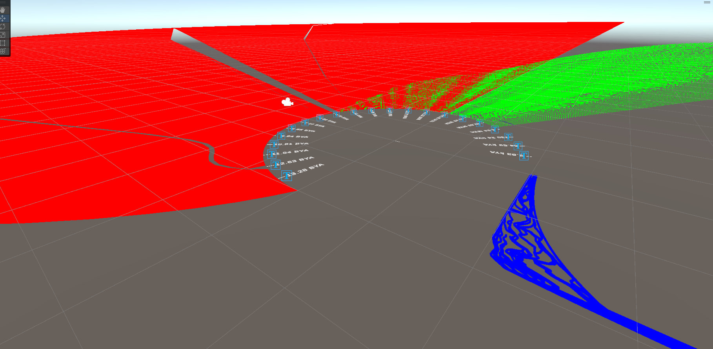

# why

A causality graph that starts at the big bang, and ends at the present moment. The graph has three sections:

- RED: All matter in the Universe
- GREEN: All life on Earth
- BLUE: All of human history

The radial scale displays two dimensions:
- Angular dimension clockwise on a logarithmic scale that places the big bang at 6, the creation of life at 10, and human history at 3
- Radial dimension is a mass/distance scale for matter, relational scale for species, and West to East location and population for human society

Sources:

https://people.cs.umass.edu/~immerman/stanford/universe.html
https://en.wikipedia.org/wiki/Observable_universe#/media/File:Home_in_Relation_to_Everything-Observable_Universe.png
https://en.wikipedia.org/wiki/Chronology_of_the_universe
https://en.wikipedia.org/wiki/Geologic_time_scale

Phylogenetic Timetree:
http://www.timetree.org/book

Human History:
https://www.thehistomap.com/about

Population data:
https://ourworldindata.org/population-growth-over-time
https://econosystemics.com/?p=9