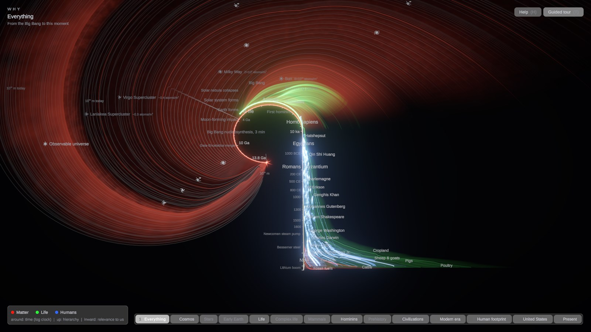
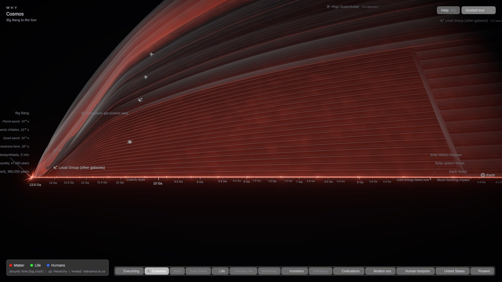
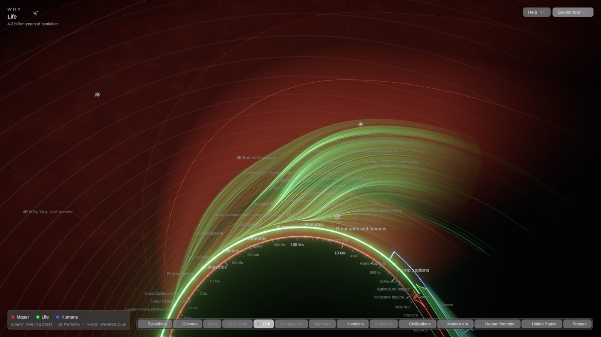
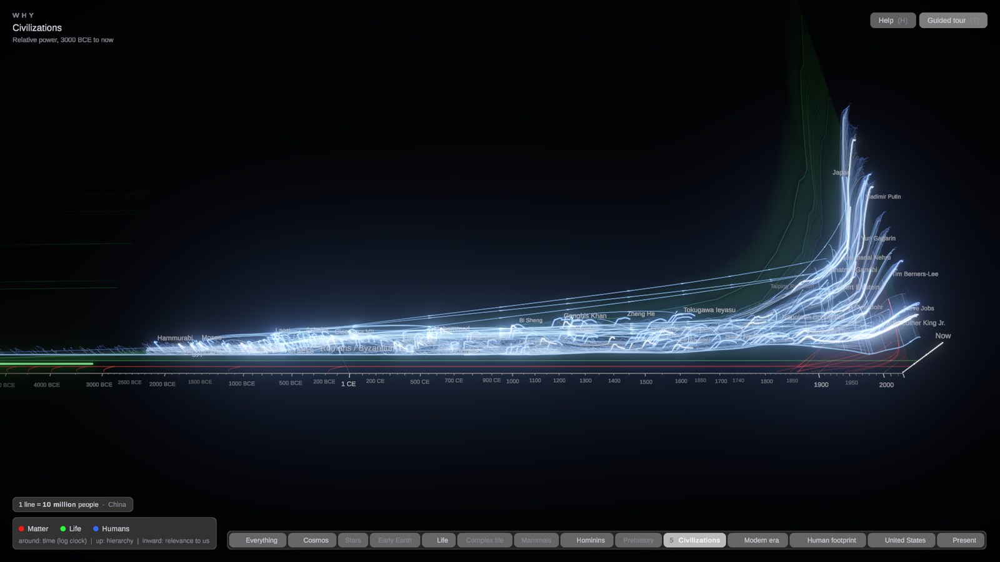
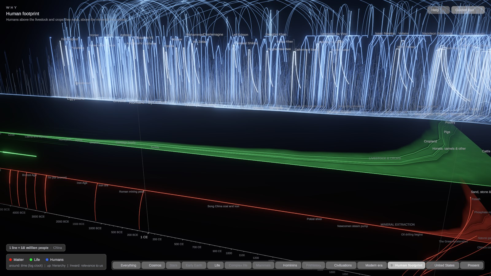
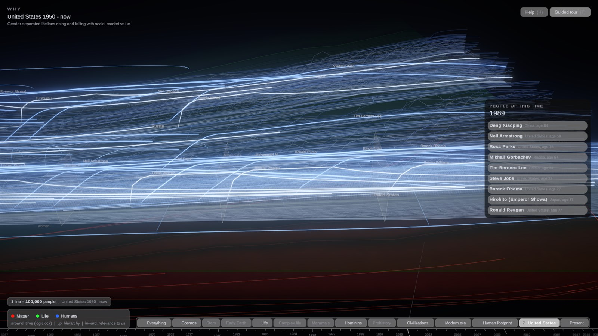
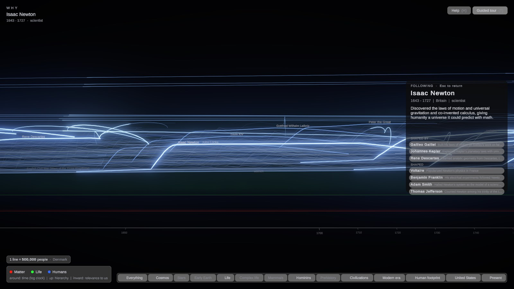
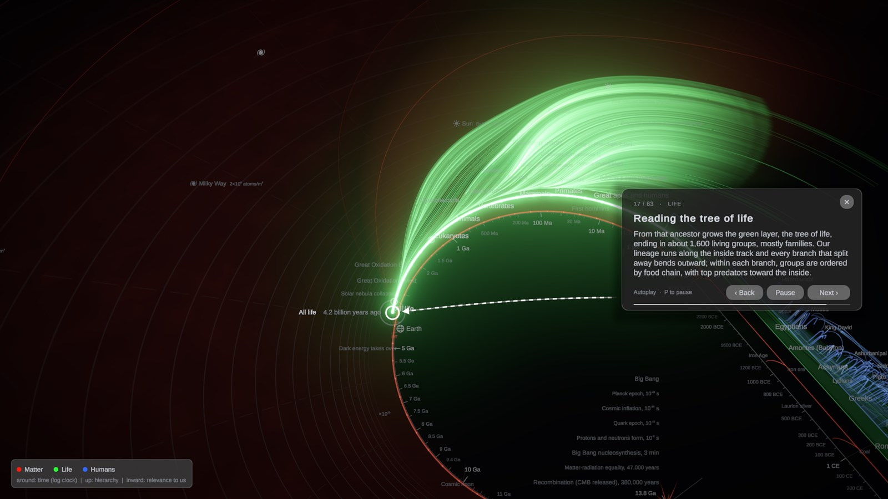
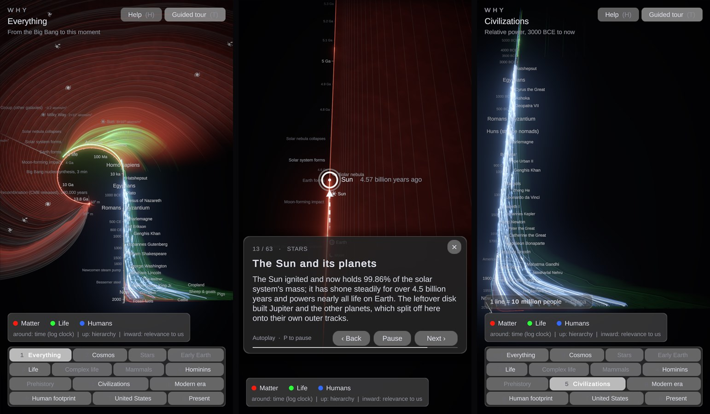

# why

A causality graph that starts at the Big Bang and ends at the present moment. It is built to show,
cleanly and at every scale, how each thing that happened made the next one possible.

## Reading the graph

| | |
| --- | --- |
| **Path** | Time runs clockwise. From the Big Bang at 6 o'clock the path circles a super-logarithmic clock of deep time (`Ft(t) = t^(t^(-1.4 - 2.39t))`): stars and the Sun, Earth, life near 10 o'clock. At 3 o'clock, 5,000 years ago, it stops being a clock: human history leaves the circle on a straight branch with near-linear time, ending at the present moment. |
| **Color** | Used for one thing only - the three levels of the universe: **red** = all matter, **green** = all life, **blue** = humans. Everything else is neutral grey. |
| **Height** | The same hierarchy: matter at the bottom, life above it, humans on top. Human lifelines rise and fall with modeled social market value. |
| **Radius** | Relevance to us. The inner track is our own lineage (universe, Milky Way, Sun, Earth, first cells ... great apes, civilizations); everything that split off along the way drifts outward and fades. |
| **Glow** | Attention: our lineage, famous figures, and whatever the guide is pointing at. |

**Red - matter.** Our home at every scale, nested from the inside out: Earth, the Sun, the Milky Way, the
Local Group, the Virgo Supercluster and Laniakea, inside the observable universe. The red layer follows
the real expansion of space (a Lambda-CDM scale factor), so it billows out across the early clock, and
every nested body grows with it as a contour that splits off smoothly, never in steps. Each region is
shaded by its real density, so the gaps between the contours read as orders of magnitude - from 3x10^30
atoms/m^3 in Earth to 2x10^5 between the stars and ~0.3 between the galaxies - and every strand carries
an icon (sun, spiral galaxy, galaxy group, supercluster, cosmic web ...). Beneath it a faint grid draws
the physical scale of that map: shells at every round distance from our lineage (10, 100, 1000 metres ...
out to the edge of the observable universe), which enter at the envelope as the universe grows past them,
and rays that follow the matter a round distance from us today back toward the Big Bang, fanning out with
the expansion of space. Between neighbouring lines the distance grows tenfold, finer lines appear as you
zoom, and the probe (G) reads real numbers anywhere: metres from us, metres per unit of the graph. Matter
dissolves before the human branch.

**Green - life.** The TimeTree of Life (1610 families) drawn as an expanding set of roots. Branches are
ordered by food chain with the top predator on the inside track, so the innermost root is the one that
leads to us: our direct ancestors glow, everything else stays dim, and the red layer recedes in the
life views. Life dissolves before the human branch; only our lineage rises into it (Homo sapiens,
300,000 years ago).

**Beneath the humans - domination.** Directly under the civilizations lies the life people control -
livestock and crops, in green, on the same mass scale as humans (livestock now outweighs us) - and
beneath that the matter people extract - fuels, ores and minerals, in red. Every domestication is marked
where the species enters the farm layer; each material rises out of Earth's matter band.

**Blue - humans.** Civilization streams from the *Histomap* (Sparks 1931) whose widths are relative
power, continued to today with GDP shares. Inside each stream a gender-separated population curve holds
individual lifelines (women inside, men outside) that rise and fall with social market value; each line
stands for N people (shown on screen). The whole human layer starts as a thread and explodes outward with population. Famous figures glow,
threads show who influenced whom, and the people panel (F) lists who was alive at any moment. The United States 1950 - now is simulated
in detail from UN age pyramids with marriage, divorce, births and partner counts (the former `smv`
project); children's lines start from their parents.

## In pictures

| | |
| --- | --- |
|  |  |
| **The cosmic fan.** Our home bodies expand with the universe, each strand marked with an icon and its density; the expansion grid fans out of the Big Bang beneath them. | **Life.** The roots of the tree of life, our direct ancestors glowing on the inside track. |
|  |  |
| **Civilizations.** Streams sized by relative power, starting as a thread and exploding with population; famous figures glow. | **Human footprint.** Humans on top, the livestock and crops they raise beneath, the minerals they mine beneath that. |
|  |  |
| **United States 1950 - now.** Gender-separated lifelines rising and falling with social market value, with the people of the moment. | **Following a figure.** Isaac Newton's life among his contemporaries, with who shaped him and whom he shaped. |
|  |  |
| **Guided tour.** 63 narrated stops with attention arrows, from the Big Bang to this moment. | **Vertical mode.** Every view, the tour and the HUD re-laid out for 9:16 phone videos. |

## Controls

| Input | Action |
| --- | --- |
| Right drag | orbit |
| Middle drag / Shift + left drag | pan |
| Scroll | zoom toward the cursor |
| W A S D / Q E | move |
| 1 - 9 | views: everything, cosmos, life, hominins, civilizations, modern era, US population, the present, human footprint |
| U | unroll the timeline around what you are looking at (again to roll back up) |
| [ / ] | widen / narrow the unrolled time window |
| L | cycle log / mixed / linear time in the unrolled window |
| T | guided tour (director mode): Space / Right next, Left back, P pause, M mute the narration, Esc exit |
| F | people of this time: famous figures alive at the moment you are looking at; click one to follow their life |
| G | scale probe: point at the red layer to read the distance from us in metres, and how many metres (and years) one unit of the graph stands for there |
| V | vertical mode: a 9:16 layout for recording phone videos (again to go back) |
| H | help |
| Hover / click a label | details / focus and highlight it |

## Narration

The guided tour is spoken. Each of its 63 stops has a narration clip (`Assets/Resources/Audio/Tour`,
about half an hour in all) that follows the four threads of the story: the three levels of the universe
and how each is built on everything before it, cause and effect as a one-way arrow, how scale works, and
the chain of causes that led to you watching. The script lives in `Data/tour_narration.json` and was
written by a language model from the tour's on-screen text; the voice is text-to-speech. To regenerate
after editing the tour, run `Tools/generate-narration.ps1` (OpenAI; key file on the desktop) and then
`Tools/synthesize-narration.ps1` (Cartesia; ffmpeg turns the clips into Ogg). A stop without a clip
simply reads its on-screen text at the usual pace.

## Vertical mode

For tutorial videos watched on a phone, the whole experience re-lays itself out whenever the window is
taller than it is wide: the HUD and tour text grow to phone size, the tour narration docks as a bottom
(or top) sheet clear of its arrow, and unrolled views turn so time runs down the screen. In the Editor,
press V in Play mode or use **Why > Game View > Portrait 1080x1920** (and **Landscape 1920x1080** to go
back); record with Unity Recorder or any screen recorder. In a built player, V opens a 9:16 window.

## Project

Unity 6000.6.3f1, URP 17.6. Open `Assets/Scenes/Why.unity` and press Play; everything is built at
runtime in about two seconds (the original took about 30 s).

* `Docs/ARCHITECTURE.md` - the rendering core: data space, the GPU warp (clock + branch + lens),
  line/surface shaders, highlight ids, anchors, layers and modules.
* `Docs/DATA.md` - every data file, its schema and its sources.
* `Tools/compile-check.ps1` - compiles the scripts against Unity's assemblies outside the Editor.

## Sources

https://people.cs.umass.edu/~immerman/stanford/universe.html
https://en.wikipedia.org/wiki/Observable_universe#/media/File:Home_in_Relation_to_Everything-Observable_Universe.png
https://en.wikipedia.org/wiki/Chronology_of_the_universe
https://en.wikipedia.org/wiki/Geologic_time_scale

Phylogenetic Timetree:
http://www.timetree.org/book

Human History:
https://www.thehistomap.com/about

Population data:
https://ourworldindata.org/population-growth-over-time
https://econosystemics.com/?p=9
https://population.un.org/wpp/Download/Standard/Population/
https://www.census.gov/data/tables/time-series/demo/fertility/his-cps.html

Life expectancy:
https://ourworldindata.org/life-expectancy-how-is-it-calculated-and-how-should-it-be-interpreted
https://ourworldindata.org/why-do-women-live-longer-than-men

Sex partners:
https://bedbible.com/average-number-of-sexual-partners-promiscuity-statistics/
https://www.cdc.gov/nchs/nsfg/key_statistics/n-keystat.htm
