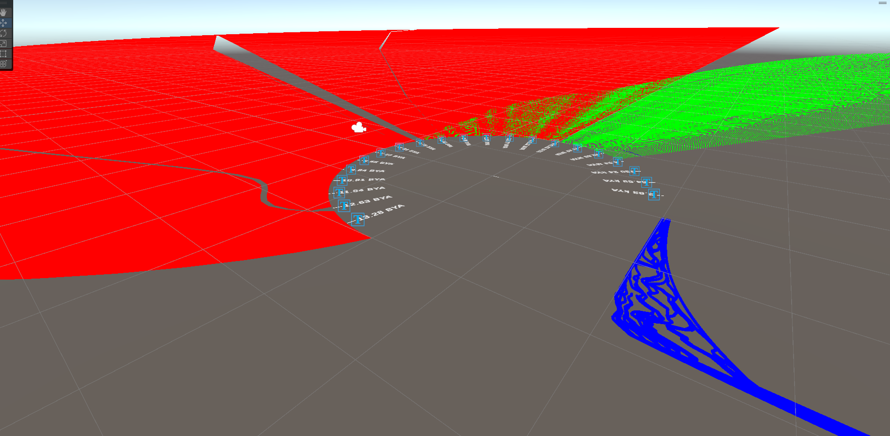

# why

A causality graph that starts at the Big Bang and ends at the present moment. It is built to show,
cleanly and at every scale, how each thing that happened made the next one possible.

## Reading the graph

| | |
| --- | --- |
| **Path** | Time runs clockwise. From the Big Bang at 6 o'clock the path circles a super-logarithmic clock of deep time (`Ft(t) = t^(t^(-1.4 - 2.39t))`): stars and the Sun, Earth, life near 10 o'clock. At 3 o'clock, 5,000 years ago, it stops being a clock: human history leaves the circle on a straight branch with near-linear time, ending at the present moment. |
| **Color** | Used for one thing only - the three levels of the universe: **red** = all matter, **green** = all life, **blue** = humans. Everything else is neutral grey. |
| **Height** | The same hierarchy: matter at the bottom, life above it, humans on top. Human lifelines rise and fall with modeled social market value. |
| **Radius** | Relevance to us. The inner track is our own lineage (universe, Milky Way, Sun, Earth, first cells ... great apes, civilizations); everything that split off along the way drifts outward and fades. |
| **Glow** | Attention: our lineage, famous figures, and whatever the guide is pointing at. |

**Red - matter.** Nested bands of the universe, the Milky Way, the solar nebula, the Sun, the planets and
Earth. The universe expands exponentially and dissipates; our home narrows along the inner edge. Matter
dissolves before the human branch.

**Green - life.** The TimeTree of Life (1610 families) drawn as an expanding set of roots. Branches are
ordered by food chain with the top predator on the inside track, so the innermost root is the one that
leads to us. Life dissolves before the human branch; only our lineage rises into it (Homo sapiens,
300,000 years ago).

**Beneath the humans - domination.** Directly under the civilizations lies the life people control -
livestock and crops, in green, on the same mass scale as humans (livestock now outweighs us) - and
beneath that the matter people extract - fuels, ores and minerals, in red. Domesticated species rise out
of their wild families in the tree of life; each material rises out of Earth's matter band.

**Blue - humans.** Civilization streams from the *Histomap* (Sparks 1931) whose widths are relative
power, continued to today with GDP shares. Inside each stream a gender-separated population curve holds
individual lifelines (women inside, men outside) that rise and fall with social market value; each line
stands for N people (shown on screen). The whole human layer starts as a thread and explodes outward with population. Famous figures glow,
threads show who influenced whom, and the people panel (F) lists who was alive at any moment. The United States 1950 - now is simulated
in detail from UN age pyramids with marriage, divorce, births and partner counts (the former `smv`
project); children's lines start from their parents.

## Controls

| Input | Action |
| --- | --- |
| Right drag | orbit |
| Middle drag / Shift + left drag | pan |
| Scroll | zoom toward the cursor |
| W A S D / Q E | move |
| 1 - 9 | views: everything, cosmos, life, hominins, civilizations, modern era, US population, the present, human footprint |
| U | unroll the timeline around what you are looking at (again to roll back up) |
| [ / ] | widen / narrow the unrolled time window |
| L | cycle log / mixed / linear time in the unrolled window |
| T | guided tour (director mode): Space / Right next, Left back, P pause, Esc exit |
| F | people of this time: famous figures alive at the moment you are looking at; click one to follow their life |
| H | help |
| Hover / click a label | details / focus and highlight it |

## Project

Unity 6000.6.3f1, URP 17.6. Open `Assets/Scenes/Why.unity` and press Play; everything is built at
runtime in about two seconds (the original took about 30 s).

* `Docs/ARCHITECTURE.md` - the rendering core: data space, the GPU warp (clock + branch + lens),
  line/surface shaders, highlight ids, anchors, layers and modules.
* `Docs/DATA.md` - every data file, its schema and its sources.
* `Tools/compile-check.ps1` - compiles the scripts against Unity's assemblies outside the Editor.

## Sources

https://people.cs.umass.edu/~immerman/stanford/universe.html
https://en.wikipedia.org/wiki/Observable_universe#/media/File:Home_in_Relation_to_Everything-Observable_Universe.png
https://en.wikipedia.org/wiki/Chronology_of_the_universe
https://en.wikipedia.org/wiki/Geologic_time_scale

Phylogenetic Timetree:
http://www.timetree.org/book

Human History:
https://www.thehistomap.com/about

Population data:
https://ourworldindata.org/population-growth-over-time
https://econosystemics.com/?p=9
https://population.un.org/wpp/Download/Standard/Population/
https://www.census.gov/data/tables/time-series/demo/fertility/his-cps.html

Life expectancy:
https://ourworldindata.org/life-expectancy-how-is-it-calculated-and-how-should-it-be-interpreted
https://ourworldindata.org/why-do-women-live-longer-than-men

Sex partners:
https://bedbible.com/average-number-of-sexual-partners-promiscuity-statistics/
https://www.cdc.gov/nchs/nsfg/key_statistics/n-keystat.htm
